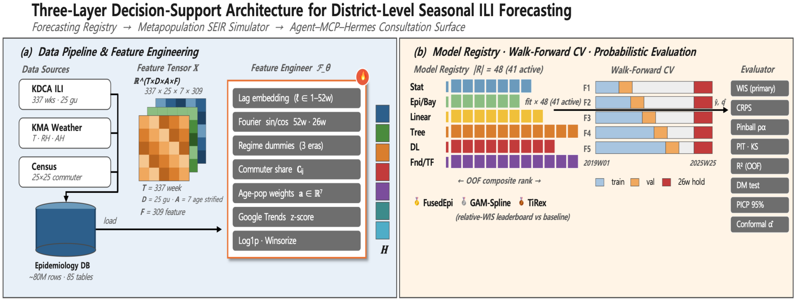
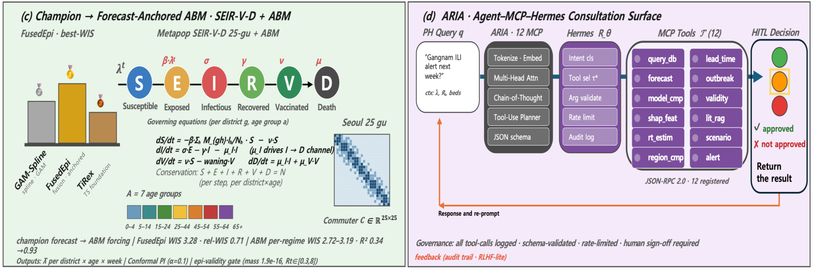

# Real-Time Influenza Forecasting and Commuter-Coupled District Transmission Modeling for Seoul's 25 Districts

### Multi-Agent Simulation of Adaptive Behavioral Responses to Infectious Disease Transmission

[](https://www.python.org)
[](https://docs.astral.sh/uv/)
[](https://pytorch.org)
[](https://lightning.ai)
[](https://optuna.org)
[](https://scikit-learn.org)
[](https://pola.rs)
[](https://www.rust-lang.org)
[](https://sqlite.org)
[](https://nextjs.org)
[](https://vercel.com)
[](LICENSE)

> An end-to-end, leakage-controlled decision-support pipeline for seasonal influenza in Seoul:
> a **48-model probabilistic forecasting registry**, a **25-district commuter- and behavior-coupled
> SEIR-V-D agent-based metapopulation**, and a **retrieval-grounded language-model advisory layer** —
> turning a calibrated city forecast into spatially and demographically targeted public-health guidance.

**MPH thesis · Graduate School of Public Health, Korea University · 2026 · Seung Jin Lee**

> 📦 This is the **public distribution**. Start with **[SETUP.md](SETUP.md)** — the database is not
> shipped, so you rebuild it from public APIs with your own keys.
> The thesis manuscript is withheld pending degree conferral and university library submission.

---

## At a glance

**The problem.** A metropolitan health department needs to know how bad the next few weeks will be,
where in the city the burden will land, and whether a different allocation of a fixed number of
vaccine doses would avert more infections. A raw surveillance curve answers none of these.

**The approach.** Three layers, each feeding the next: a probabilistic forecasting registry picks a
leak-free champion; that forecast anchors an agent-based metapopulation that carries the mechanism
and answers counterfactuals; a retrieval-grounded advisory layer renders the output as
source-checked guidance.

| | | |
|---|---|---|
| **Data** | KDCA sentinel ILI, 337 weeks | per 1,000 outpatient visits, 7 age bands |
| **Layer 1 — forecast** | 48 models, 124 metrics | champion selected on out-of-fold WIS only |
| **Layer 2 — mechanism** | per-agent SEIR-V-D, 25 districts × 7 ages | forward R² 0.722 anchored |
| **Layer 3 — advisory** | MCP tool contract, multi-LLM | performs no forecasting |
| **Best result** | relative WIS **0.44** | below 1.0 — competitive with hub forecasters |
| **Hardest limit** | alert lead time **0 weeks** | a nowcast, not an early warning |

**What to read next.** [The public-health problem](#the-public-health-problem) for the framing and
the honest limits · [Headline results](#headline-results) for the numbers ·
[SETUP.md](SETUP.md) to run it.

---

## System overview

<p align="center">
  
</p>

*(a)* data pipeline and feature engineering · *(b)* the 48-model registry with walk-forward CV and
probabilistic scoring.

<p align="center">
  
</p>

*(c)* the champion forecast driving the commuter-coupled SEIR-V-D metapopulation · *(d)* ARIA, the
tool-grounded advisory surface.

---


## The public-health problem

A metropolitan health department planning for an influenza season needs three things a raw
surveillance curve does not give it: **how bad the next few weeks will be**, **where in the city**
that burden will land, and **whether a different allocation of a fixed number of doses would avert
more infections**. This repository is an attempt at all three, with the limits of each stated.

### What is actually being forecast

The outcome is the **KDCA sentinel influenza-like-illness consultation rate** (의사환자분율) —
influenza-like consultations per **1,000 outpatient visits**, reported weekly from a sentinel clinic
panel (~200 clinics in 2019, expanding toward ~300), stratified into seven age bands
(0, 1–6, 7–12, 13–18, 19–49, 50–64, 65+). The series runs **337 weeks**, split chronologically into
242 train / 27 validation / 68 sealed test.

Three properties of this estimand govern everything downstream, and are easy to get wrong:

- **It is a proportion conditioned on care-seeking, not incidence.** The denominator is outpatient
  visits at self-selected sentinel clinics, so it moves with consultation behaviour, holidays and
  clinic mix as well as with transmission. Translating it into population attack rate would need an
  ascertainment model that this work does not fit.
- **It is syndromic, not laboratory-confirmed.** ILI includes non-influenza respiratory viruses.
- **The modelled series is an *unweighted* mean of the seven age strata.** In the stored data the
  school-age band (7–12) averages ≈27.7 while 65+ averages ≈4.3, so an unweighted mean up-weights
  children relative to a population-weighted rate. Levels here are therefore **not directly
  comparable to published KDCA headline ILI figures**.

### What it can inform, and how far

| Question | What the system gives | Honest limit |
|---|---|---|
| *Is an epidemic week under way?* | alert F1 ≈ 0.97 | **Nowcast.** Median lead time 0 weeks; 5 of 12 scored models fire a week *late*. You cannot pre-position on this. |
| *How bad over the next month?* | recursive multi-horizon forecast | R² decays 0.944 (1 wk) → 0.804 → 0.560 → **0.337 (4 wk)** → −0.466 (8 wk) over 53 leak-free origins. **Four weeks is the defensible planning window** — matching the CDC FluSight operating horizon — and beyond it the forecast is worse than predicting the mean. ⚠ These values are documented in `docs/SUPPLEMENTARY_DOSSIER_20260627.md`; the underlying `expanding_multihorizon/result.json` is **not shipped**, so they cannot be recomputed from this distribution. |
| *Where in the city?* | 25-district burden surface | **Model-derived only.** No per-district weekly ILI observation exists for Seoul, so this layer has no ground truth to be scored against. |
| *Which allocation averts more?* | targeted vs uniform vaccination, with CIs | 1.83 vs 1.38 infections averted per dose (≈33% gain) — but "high-contact" is an *assumed* exposure ordering, not measured Seoul contact data. |
| *What if we intervene?* | NPI, vaccination campaign, antiviral prophylaxis scenarios | Output is averted burden vs a no-intervention baseline with uncertainty, which is the form a resource-allocation argument needs. |

### Where the public-health reading is counter-intuitive

Two results run against expectation and are reported rather than smoothed over.

**Targeting the elderly performs worst**, not best, on infections averted per dose. Within a single
three-arm run (`abm_counterfactual/result.json`, K = 12, 10% budget) the ordering is elderly **1.13**
< uniform **1.42** < high-contact **1.86**, and it survives a robustness sweep at different
population size and budget. (The headline 1.83 / 1.38 pair above comes from the separate
confidence-interval run, which has only the two arms — the numbers are close but should not be
mixed across files.)

This is a transmission-efficiency result, not a mortality one — vaccinating
high-contact adults interrupts more chains, whereas the elderly benefit is concentrated in severity.
A dose-allocation policy would need both objectives weighed explicitly; this repository quantifies
only the first.

**The behavioural layer implies interventions face a moving target.** Because modelled contact falls
as perceived prevalence rises, a share of any epidemic's flattening is spontaneous behaviour rather
than policy — which means naive before/after evaluation of an NPI will over-credit the NPI.

### What this cannot support

- Per-district or per-age **ILI claims presented as observed** — both are simulation output.
- Comparison of headline levels against published KDCA rates (age-weighting differs, above).
- **Per-capita risk targeting.** The district burden surface tracks population headcount
  (Spearman ρ ≈ 0.75 against resident population); normalised by population the association does not
  hold, so it answers *where the most cases occur*, not *where risk per person is highest*.
- **Chronic-disease vulnerability.** A KNHANES-grounded comorbidity layer exists in the codebase but
  is **not wired into** the agent kernel or the counterfactual engine, so it does not shape any
  reported result.
- Anything outside seasonal influenza in Seoul. Same-period transfer held for northern-temperate
  systems and failed for tropical ones; cross-pathogen transfer is untested.

---

## Headline results

| | Result | Honest reading |
|---|---|---|
| **Champion** | `FusedEpi` — selected leak-free on out-of-fold WIS, without inspecting the test partition | Not chosen by test-set argmin, which avoids the winner's curse. **Sensitive to the OOF aggregation** — see below |
| **Probabilistic skill** | relative WIS **0.44** (FluSight-style pairwise) · **0.71** vs FluSight baseline · hold-out WIS **3.28** | Both below 1.0 — competitive with collaborative-hub forecasters |
| **Point accuracy** | R² **0.936** | **Autocorrelation-dominated, not treated as skill** — a persistence forecast alone reaches ≈0.85 |
| **vs strongest foundation model** | Diebold–Mariano **p = 0.231** | A statistical **tie**, reported as such — the edge is calibration, not point error |
| **Calibration** | 95% interval coverage **0.735 → ≈0.90** via adaptive conformal | Still short of the nominal 0.95, stated plainly |
| **Outbreak alert** | alert F1 **0.99** | **A nowcast, not an early warning.** Median lead time across the scored panel is **0 weeks**, and 5 of 12 models fire a week *late* |
| **Behavioral coupling** | forward R² **0.557** (behavior on) vs **0.041** (off) | Pre-specified peak window; 0.557 is the best of a 3-point sensitivity sweep, and the 26-origin average effect is **not** statistically established |
| **ABM forward skill** | **0.722** anchored to the champion; **0.789** with EnKF assimilation | Anchoring is load-bearing — unanchored, the same variants score far below zero. The exact figure is withdrawn: it came from a transposed affine map (fixed 2026-07-19) and the ablation needs re-running. A mechanism engine, not a forecaster |
| **ABM calibration** | ABC-SMC coverage **4/4** at the 90% level | But simulation-based calibration **fails on all four parameters** — they are weakly identified, and this is reported, not buried |
| **Spatial structure** | commuter import highest in central business districts (Jung-gu 0.38) | Structural surface derived from the commuter matrix. **No per-district ILI observation exists**, so this layer cannot be externally validated |
| **Targeted vaccination** | **1.83** vs **1.38** infections averted per dose (paired *t*, p < 0.001, Cohen's *dz* = 3.35) | ≈33% efficiency gain from allocation alone — but conditional on an *assumed* exposure ordering, and it vanishes in a homogeneous negative control |

---

## The three layers

### 1 · Forecasting registry — 48 models, one leak-free champion

Every model is scored on a 124-metric battery under a strict train / validation / sealed-test
protocol with walk-forward rolling-origin cross-validation. The champion is selected **only** on
out-of-fold WIS inside a 1-SE statistical-tie band (fold stability → parsimony → OOF-WIS), never
on the sealed test set.

### 2 · Behavioral metapopulation — 25 districts, SEIR-V-D with adaptive behavior

This is the mechanism engine, and it is genuinely agent-level: `simulation/abm/agent_kernel.py`
carries a per-agent state vector across **25 districts × 7 age bands**, advanced by a daily binomial
tau-leap through S → E → I → R → V → D with leaky vaccination, waning immunity and mortality.
Districts are coupled by a 25×25 commuter mixing matrix.

**Behaviour is individual, not a global multiplier.** Each agent holds its own `theta`, `alpha`,
`kappa` and `tau`, plus fatigue and compliance state, so contact falls as *perceived* local
prevalence rises and recovers as attention decays. Turning that layer off collapses forward skill:

| | forward R² |
|---|---|
| behaviour on | **0.557** |
| behaviour off | **0.041** |

The honest caveat: 0.557 is the best of a three-point `theta_sd` sensitivity sweep
(0.10 → 0.217, 0.15 → 0.557, 0.25 → 0.539), so treat the *direction* as the finding and the
magnitude as sweep-dependent. The pooled 26-origin effect is not statistically established.

**The champion is selected on an outbreak-weighted score, and that choice is the point.**
Selection runs on the out-of-fold WIS aggregated as `0.5 · mean(quiet folds) + 0.5 · mean(elevated
folds)` — outbreak weeks carry half the weight regardless of how many of them a model's folds
happen to contain. That is deliberate: a forecaster for a health department is judged on epidemic
periods, not on how quietly it behaves in the off-season. Because it is an average of two group
means, the score does not depend on fold count.

`FusedEpi` wins on exactly the part that is weighted: its elevated-fold WIS averages **2.297**
against `GAM-Spline`'s **2.599**. GAM-Spline is better in quiet weeks, which is why it leads on an
unweighted mean of the same folds — and why the unweighted mean is not what is used. Every model's
`selection_oof_wis` (the unweighted alternative) and `n_oof_folds` ship in
`per_model_metrics.csv` so the comparison can be redone either way.

All eight models in the 1-SE band are a declared statistical tie (SE is 36% of the mean), so no
strong claim is made that FusedEpi is *the* best model — only that it is the one the pre-specified,
leak-free, outbreak-weighted rule selects.

**It is anchored to the forecast, and that is not a detail.** The champion drives the ABM, giving a
forward R² of **0.722**; adding EnKF assimilation lifts a base origin from 0.725 to **0.789**, a gain
the result file shows to be champion-specific rather than a generic EnKF effect. Run the same
variants *without* anchoring and forward R² goes sharply negative — so the ABM is a mechanism and
counterfactual engine, not a standalone forecaster, and the repository does not claim otherwise.

> **The specific unanchored figure previously quoted here (−633) is withdrawn.** It was produced by
> `variant_ablation.py` applying `_fit_linear_map`'s `(offset, scale)` return as `offset·x + scale`,
> with the two coefficients transposed. The tell was the companion `in_sample_r2 = −766.65`: an
> affine fit scored on the data it was fitted to cannot go below zero. The code is fixed and pinned
> by `simulation/tests/test_affine_map_orientation.py`, but the ablation needs a database to re-run,
> so `simulation/results/abm_variant_ablation.json` still holds the uncorrected values and is marked
> as such. The qualitative claim — anchoring is what makes the ABM track the observed series — rests
> on the anchored 0.722 and the behaviour-on/off contrast, both of which are computed elsewhere and
> are unaffected.

**Calibration is reported with its failure.** ABC-SMC reaches 4/4 parameter coverage at the 90%
level, but simulation-based calibration (SBC) — a stricter test — **fails on all four parameters**
(`simulation/results/abm_sbc/result.json`: rank-uniformity p = 0.0, 0.0, 0.007, 0.0; the file's own
verdict is that the posterior is uncalibrated). The parameters are weakly identified, and "4/4
coverage" should not be read as "the posterior passed SBC".

**What it is for** is counterfactuals the forecaster cannot express. Targeting vaccination at
high-contact agents averts **1.83** infections per dose versus **1.38** for uniform allocation
(paired *t*, p < 0.001, Cohen's *dz* = 3.35) — and the effect **vanishes in a homogeneous negative
control**, which is what shows it is a property of contact heterogeneity rather than an artefact.

Commuter import is highest in the central business districts — Jung-gu 0.38, Gangnam 0.30, Jongno
0.27 — but read that surface carefully: import fraction is **bimodal**, rising both where outsiders
flow in (CBDs) and where residents flow out (bedroom districts such as Eunpyeong at 0.17). The two
imply opposite interventions. The reported Moran's I (0.0613 vs −0.0417 expected, p = 0.028) is a
weak spatial-autocorrelation statistic computed on that structural surface with the commuter matrix
as its own weight matrix, so it is close to a tautology and is **not** evidence of infection
clustering.

A realism ablation (`abm_realism_ablation_table.csv`) settles which mechanism actually earns its
complexity:

| Variant | Mechanism | Forward R² | RMSE |
|---|---|---|---|
| A | mean-field (district force of infection) | 0.749 | 6.02 |
| B | agent-to-agent contact network | 0.681 | 6.78 |
| A+B | prediction ensemble | 0.753 | 5.97 |
| H | hybrid fusion (mean-field ⊕ network) | 0.795 | 5.44 |
| H+EnKF | hybrid + real-time assimilation | **0.817** | **5.13** |

The explicit contact network alone is *worse* than plain mean-field mixing — reported rather than
hidden — but fusing the two beats either, and assimilation adds on top of that. Every run passes an
epi-validity gate checking
S+E+I+R+V+D = N conservation and Rt within [0.3, 8] — note these are gate *thresholds*, not measured
summary statistics, and the gate's numeric report is not part of this distribution.

### 3 · ARIA — retrieval-grounded advisory layer

A three-tier language-model surface (retrieval and tools → agent orchestration → tamper-evident
audit log) that renders quantitative output into source-checked, human-in-the-loop guidance.
It performs **no forecasting**.

---

## Live dashboard

The web layer renders the forecast, the district surface and the agent population together, with
ARIA available alongside as a consultation panel.

<p align="center">
  
</p>

```bash
npm --prefix web install && npm --prefix web run dev   # http://localhost:3000
```

Every figure in the thesis is reproducible from this repository: figure sources live under
[`paper/`](paper/), the complete 124-metric evaluation matrix is rendered under
[`paper/full_eval_matrix/`](paper/full_eval_matrix/), and every analysis output backing the paper
(metrics, checkpoints, SHAP, training history, ABM diagnostics) is in
[`simulation/results/`](simulation/results/).

**Feature attribution is reported by what was measured, not by what was attempted.**
Of the 41 models with a SHAP directory, permutation importance registered a non-zero
attribution for **18** and native SHAP for **27**; the rest are marked *not measured* in
`simulation/results/shap/REPORT.md`. Those counts previously read 34 and 34, because the
code decided a model had been explained by testing a ranking for truthiness — and the
ranking is a full list of `(feature, 0.0)` pairs even when nothing registered. The same
zero vector, stably sorted, produced a "top features" column that was really just the
first four feature columns. Seven all-zero `shap_values.npy` files have been removed
rather than shipped as explanations. Fixed 2026-07-19; pinned by
`simulation/tests/test_shap_zero_is_not_measured.py`.

---

## Quick start

This project is **uv-based** and requires **Python ≥ 3.12**.

```bash
git clone https://github.com/arer90/seoul-ili-forecast-abm.git
cd seoul-ili-forecast-abm

uv venv --python 3.12
uv pip install -r requirements.lock        # dependency SSOT
```

`uv sync` also works and is the shorter path — `pyproject.toml` declares the full dependency set,
including the ARIA layer. `requirements.lock` is the stricter option: it pins the exact versions that
produced the published numbers, so use it when you want bit-identical reproduction rather than a
current-compatible environment. [SETUP.md](SETUP.md) covers both, plus a plain-`pip` fallback.

Then supply your API keys and build the database:

```bash
cp simulation/data/api_key.example.txt simulation/data/api_key.txt   # or: cp .env.example .env
# fill in your own keys, then
.venv/bin/python -m simulation db-status
.venv/bin/python -m simulation collect --groups all
```

Full instructions and key sign-up links: **[SETUP.md](SETUP.md)**.

Keys are yours to issue and revoke, but a few hazards are specific to this codebase and worth
reading before you deploy — collector logs record the request URL, and Korean government APIs put
the key *in* that URL; the dashboard's map key is inlined into the client bundle and can only be
restricted by domain at the provider console; and `PUBLIC_DEMO=1` without Upstash configured turns
the chat route into an unauthenticated, unmetered proxy to your paid LLM key. Details, with the
lines of code that cause each: **[SETUP.md §7](SETUP.md#7-key-handling--read-this-before-you-deploy)**.

---

## Not included

The code, every analysis output backing the paper, the figure and table sources and the presentation
decks are all here. Four things are not, and each is recoverable:

| Missing | Why | How to get it |
|---|---|---|
| The database, `simulation/data/db/*.db` (~13 GB) | Too large for GitHub, and redistributing the source agency data is not ours to do | `simulation collect` with your own API keys — [SETUP.md](SETUP.md) |
| Raw collected CSVs, `simulation/data/collected/**` | Individual files exceed GitHub's 100 MB per-file limit | Re-fetched by the collectors |
| Trained model weights, `models/*.pt` (~2.9 GB) | Same file-size limit | Regenerated by a training run |
| The thesis manuscript | Withheld pending degree conferral and university library submission | Korea University library, after conferral |

`api_key.txt` and `.env` are absent by design — they are secrets. Copy the shipped
`api_key.example.txt` / `.env.example` and fill in your own.

---

## Time and resources

What it actually cost to produce the published results, on one machine:

| | |
|---|---|
| **Hardware** | A single Apple M4 Max laptop, 36 GB unified memory. No cluster, no cloud GPU. |
| **Full pipeline span** | 2026-07-01 → 2026-07-15 wall-clock. This includes re-runs and re-analysis, so it is not 14 days of continuous compute. |
| **Data and feature stage (R1–R8)** | ~18 minutes end to end |
| **Model optimisation and evaluation (R9–R10)** | The long pole — per-model Optuna studies across the 48-model registry, run under subprocess isolation, hours per sweep |
| **Database** | 85 tables, ~13 GB, built from public agency APIs. The single largest table is hourly bus ridership at ~78 M rows. |
| **Series under model** | 337 weeks × 25 districts × 7 age groups × 309 engineered features |
| **Evaluation** | 48 models × a 124-metric battery, under walk-forward rolling-origin CV |
| **Repository** | ~275 MB, ~2,200 files |

Two constraints shaped the engineering more than raw speed did. Long runs had to survive 6–24 hours
without leaking memory, so every Optuna trial runs in an isolated subprocess and the OS reclaims it.
And `n_jobs` is capped at 2 throughout — `-1` deadlocked the machine.

---

## Project layout

```
simulation/
├── __main__.py        # single entry point:  python -m simulation <cmd>
├── cli/               # 26 commands
├── collectors/        # public-API collection → SQLite (85 tables)
├── database/          # safe_connect, bulk_insert, DuckDB read overlay
├── models/            # 48-model registry + feature engine
├── pipeline/          # R1–R12 research track · P1–P5 production track
├── abm/               # SEIR-V-D metapopulation, behavioral layer, EnKF, ABC-SMC
├── llm_compare/       # ARIA advisory layer
├── analytics/         # conformal prediction, scoring
├── rust/              # optional SEIR accelerator (PyO3 + Maturin)
└── results/           # analysis outputs backing the paper
paper/                 # figure and table source assets, presentation decks
web/                   # Next.js dashboard (map, scenarios, ARIA panel)
docs/                  # design and methodology documentation
```

---

## Common commands

```bash
python -m simulation --help              # 26 commands
python -m simulation db-status           # database health
python -m simulation doctor              # environment diagnostics
python -m simulation list-models         # registered models
python -m simulation sim --list-scenarios
bash scripts/launch_full_run.sh          # full training run (detached, preflight-gated)
bash scripts/audit_and_retrain.sh        # post-run audit, retrain and compare
```

## Tests

Run **one file at a time on macOS** — a whole-suite run can segfault through LightGBM/OpenMP.

```bash
pytest tests/test_docx_numbers_match_results.py -q   # paper numbers ↔ shipped results
pytest tests/test_g339_champion_leakfree.py -q       # leak-free champion selection
pytest tests/test_count_glms_are_real.py -q          # count GLMs are genuine log-link fits
```

Before the database exists, the ABM modules cannot be imported (they read the database at module
load), which interrupts whole-directory collection — see [SETUP.md](SETUP.md) §6.

---

## Stack

**Modeling** — PyTorch · Lightning · scikit-learn · XGBoost / LightGBM · statsmodels · Optuna ·
time-series and tabular foundation models · conformal prediction
**Data** — Polars (lazy / streaming) · SQLite (single writer, WAL) · DuckDB read overlay
**Acceleration** — Rust 2021 (`seir_core` via PyO3 / Maturin, with automatic Numba fallback) · WASM
**Web** — Next.js 14 · React · Tailwind CSS · DeckGL / MapLibre · Recharts · Vercel
**LLM layer** — Anthropic Claude · OpenAI · Google Gemini · Ollama, behind an MCP tool contract
**Tooling** — uv · pytest · ruff

---

## Scope and limitations

Stated plainly, as in the thesis:

- Validation is confined to **Seoul influenza**. Same-period cross-region transfer held for
  northern-temperate systems but failed for tropical ones, and cross-pathogen transfer is untested.
- The high R² is **autocorrelation-dominated** and is not the basis of the skill claim.
- The outbreak alert is **concurrent detection, not advance warning**. The anticipatory function
  comes from a separate recursive multi-horizon forecast with an honest horizon of about four weeks.
- Per-district and per-age ILI are **unobserved**, so those surfaces are model-derived.
- The behavioral result rests on a **single phase-shifted season**; the pooled 26-origin effect is
  not statistically established.
- ILI is a **syndromic indicator**, not laboratory-confirmed influenza. Outputs should inform, not
  replace, laboratory and clinical judgment.

---

## License

[MIT](LICENSE)

## Citation

```bibtex
@mastersthesis{lee2026seoulili,
  author  = {Lee, Seung Jin},
  title   = {Real-Time Influenza Forecasting and Commuter-Coupled District Transmission
             Modeling for Seoul's 25 Districts: Multi-Agent Simulation of Adaptive
             Behavioral Responses to Infectious Disease Transmission},
  school  = {Graduate School of Public Health, Korea University},
  year    = {2026},
  type    = {Master of Public Health thesis}
}
```
