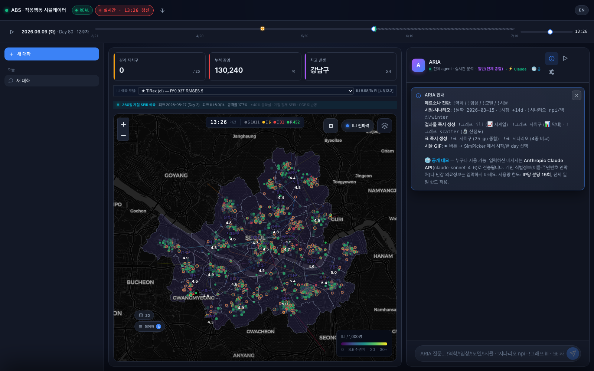
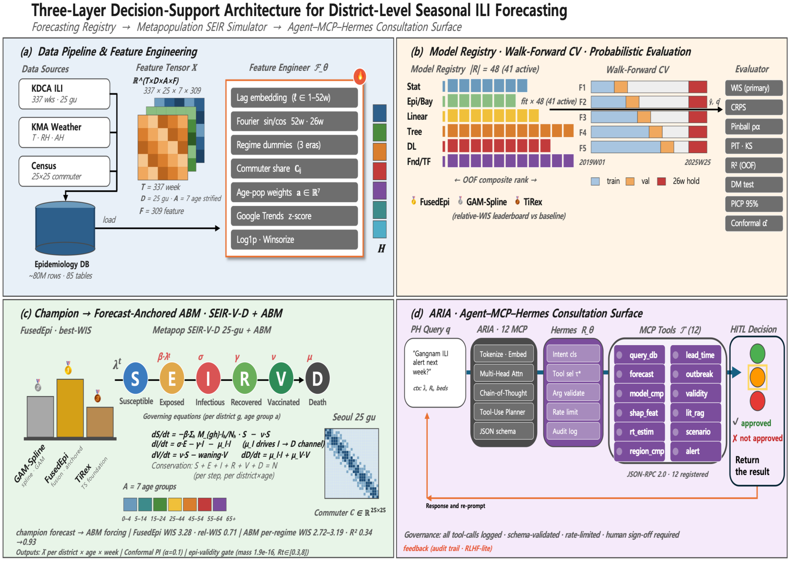

# Key-handling fixes — 2026-07-19

Three defects found by a code audit of the distribution repository, fixed and verified by running
them. All three concern API keys: one leaked them into log files, one turned quota exhaustion into
silent data loss, and one left a public deployment unmetered.

**No scientific code was touched.** Nothing in the forecasting registry, the metapopulation
simulator or the evaluation battery changed, and the published numbers are unaffected — the
paper-number guard still passes (11/11).

---

## 1 · Keys leaked into log files

Korean government APIs authenticate by URL rather than by header. The Seoul Open API key sits in the
request **path**, and data.go.kr takes `serviceKey` as a **query parameter**:

```python
url = (f"{SEOUL_BASE}/{KEYS['seoul_general2']}"      # ← the key IS the path
       f"/json/SPOP/{start}/{end}/{date}")
```

The collector logged that URL verbatim on every failure, so each 4xx, 5xx or timeout wrote a live
credential into `simulation/logs/collect_*.log`:

```python
# before — simulation/collectors/legacy/base.py:63
log.error(f"  FAIL after {elapsed}s: {url} → {last_err}")
```

A second site was worse: it logged the parameter dict too, which carries `serviceKey`.

```python
# before — simulation/collectors/legacy/group_s_sentinel.py:98
log.warning(f"  API result=false: {url} params={params}")
```

Those logs are gitignored, but they are exactly the files an operator tars up when asking for help,
and any log shipper ingests them verbatim.

### Fix

A single masking function, placed next to `KEYS` in `simulation/database/config.py` so it stays in
sync with whatever keys are actually configured. It is **data-driven** — it masks the real key
*values* rather than guessing parameter names — so it works regardless of where in the URL a key
appears:

```python
def redact_secrets(text: object) -> str:
    """Mask every configured API key occurring anywhere inside ``text``."""
    s = str(text)
    for value in set(KEYS.values()):
        if not value or len(value) < _REDACT_MIN_LEN:
            continue
        s = s.replace(value, _REDACT_MARK)
        encoded = quote(value, safe="")
        if encoded != value:
            s = s.replace(encoded, _REDACT_MARK)
    return s
```

Both the raw and the percent-encoded form are masked, so it works whether the caller logs the URL it
built itself or the fully encoded `response.url` that `requests` produced. Values under 8 characters
are skipped — a short leftover placeholder would match unrelated substrings and mangle the line
instead of protecting it.

Wired into all three logging sites:

```python
# after
log.error(f"  FAIL after {elapsed}s: {redact_secrets(url)} → {last_err}")
```

---

## 2 · A rate-limited collector gave up immediately

The retry wrapper retried only on 5xx. **HTTP 429 is a 4xx**, so it fell through to `break`:

```python
# before — simulation/collectors/legacy/base.py:47-51
if status_code >= 500 and attempt < MAX_RETRY:
    log.warning(f"  Retry {attempt}/{MAX_RETRY}: {last_err}")
    time.sleep(RETRY_WAIT * attempt)
    continue
break  # client errors such as 4xx do not need retrying
```

`API_MAX_RETRY = 4` gave a false sense of resilience: it never applied to quota exhaustion. The
moment a daily quota ran out the collector stopped retrying, returned `None`, and the loop skipped
every remaining item — completing with **partial data and nothing to distinguish it from a genuinely
sparse API response**.

### Fix

429 now retries, honouring `Retry-After` where the server sends it, and a distinctive marker is
logged when retries are exhausted so silent truncation becomes greppable:

```python
# after
if (status_code >= 500 or status_code == 429) and attempt < MAX_RETRY:
    wait = RETRY_WAIT * attempt
    if status_code == 429:
        wait = max(wait, _retry_after_seconds(e.response))
    log.warning(f"  Retry {attempt}/{MAX_RETRY} ({wait:.0f}s): {last_err}")
    time.sleep(wait)
    continue
if status_code == 429:
    log.error(
        f"  QUOTA-EXHAUSTED after {MAX_RETRY} retries: "
        f"{redact_secrets(url)} — 이후 항목이 누락됩니다"
    )
break  # other 4xx client errors do not need retrying
```

The Korean tail of that message, `이후 항목이 누락됩니다`, reads "subsequent items will be missing"; it
is kept verbatim because it is the emitted log string operators grep for.

`Retry-After` is capped at 120 s (`RETRY_AFTER_CAP`), so a server asking for a full day cannot stall
the whole collection run.

---

## 3 · Public demo mode ran with no rate limit at all

`web/lib/upstash.ts` returns `null` from both limiter factories when `UPSTASH_URL` / `UPSTASH_TOKEN`
are unset, and the chat route guarded with `if (rl)` — so the check was **skipped entirely**. The
daily spend cap failed open in the same way, returning `{ allowed: true }`.

Combined with `PUBLIC_DEMO=1`, which removes the auth gate, that left an **unauthenticated,
unmetered proxy to a paid LLM key**. Nothing errored and nothing was logged.

The docstring actively misled on this point, claiming the per-IP limit still applied. It did not —
both helpers depend on the same `redis()` call and vanish together. The docstring is corrected.

### Fix

Fail closed, with a documented escape hatch for local development:

```ts
// web/app/api/chat/route.ts
if (isPublic && !rl) {
  if (process.env.ALLOW_UNMETERED_PUBLIC_DEMO !== "1") {
    console.error(
      "[chat] PUBLIC_DEMO=1 but Upstash is not configured — refusing. " +
        "Set UPSTASH_URL and UPSTASH_TOKEN, or ALLOW_UNMETERED_PUBLIC_DEMO=1 for local dev.",
    );
    return new Response(
      JSON.stringify({ error: "rate_limiter_unavailable", /* … */ }),
      { status: 503, headers: { "content-type": "application/json" } },
    );
  }
  console.warn(
    "[chat] ALLOW_UNMETERED_PUBLIC_DEMO=1 — running with NO rate limit and NO daily cap.",
  );
}
```

> **Note for this deployment:** `web/.env.local` already sets `PUBLIC_DEMO=1`. That file is
> gitignored and local-only, so nothing was ever publicly exposed — but had it shipped as-is, this
> is precisely the path it would have taken.

---

## Results

### Regression guards — 19/19

`simulation/tests/test_key_redaction_and_429_retry.py` (macOS needs per-file runs):

```
$ .venv/bin/python -m pytest simulation/tests/test_key_redaction_and_429_retry.py -q
...................                                                      [100%]
19 passed in 0.05s
```

| Group | Cases | Covers |
|---|---|---|
| `redact_secrets` | 7 | key in path · key in query string · percent-encoded form · params dict · short values left alone · empty/missing keys · non-string coercion |
| `Retry-After` parsing | 6 | `30`→30 s · `0` · absent · unparseable HTTP-date · `86400`→capped at 120 s · negative→0 |
| Retry behaviour | 4 | 429 retried and succeeds · 404 still fails fast (1 call) · 500 still retried · exhausted 429 emits `QUOTA-EXHAUSTED` |
| Log hygiene | 2 | failure log contains no key · static scan blocks un-redacted `{url}` / `{params}` logging from reappearing |

The static guard is not vacuous — replayed against the pre-fix files it flags exactly the two
defects that were fixed:

```
before fix simulation/collectors/legacy/base.py:            ['base.py:63']
before fix simulation/collectors/legacy/group_s_sentinel.py: ['group_s_sentinel.py:98']
after fix: 1 passed
```

### End-to-end HTTP verification

The web fix was driven against a running dev server rather than asserted:

| Configuration | Expected | Observed |
|---|---|---|
| `PUBLIC_DEMO=1`, no Upstash | refuse | **503** `rate_limiter_unavailable` + `console.error` |
| `PUBLIC_DEMO=0` (token-gated) | unchanged | **401** `unauthorized` — the pre-existing auth gate, untouched |
| `PUBLIC_DEMO=1` + `ALLOW_UNMETERED_PUBLIC_DEMO=1` | proceed | **400** `no providers supplied` — passed the limiter, reached body validation, warning logged |

### No regressions

| Check | Result |
|---|---|
| `python -m compileall simulation/` | exit 0 |
| Modified modules import | 3/3 clean |
| `npx tsc --noEmit` | exit 0, no output |
| `tests/test_docx_numbers_match_results.py` | 11 passed — published numbers unchanged |
| Diff size | +130 / −11 across 5 files, plus one new test file |

---

## The system these fixes protect

The dashboard the LLM proxy serves — forecast, district surface and agent population, with the
advisory panel alongside:



Where each fix sits in the architecture: the collectors that leaked keys feed panel (a); the quota
handling determines whether panel (b) trains on complete data; the rate limiter guards panel (d).



---

## Still open — not code problems

These remain the deployer's own responsibility and are documented in
[SETUP.md §7](../SETUP.md#7-key-handling--read-this-before-you-deploy):

- **`NEXT_PUBLIC_VWORLD_KEY` cannot be made secret.** Next.js inlines it into the client bundle and
  it travels in the tile URL. Only domain restriction at the VWorld console protects it.
- **`seoul_general2` has no environment variable** — container/CI deployments that inject only env
  vars cannot set it, and it is indexed unguarded.
- **Duplicate labels overwrite last-wins** for `data_go_kr` and `kma_hub`.
- **Rotation** happens at the issuing portal, per deployment.
